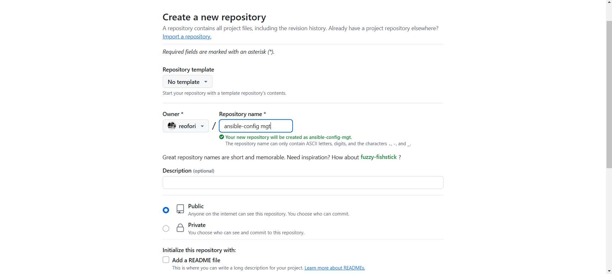

# Ansible-Configuration-Management-Automate-Project-7-to-10-

## Step 1 - Install and Configure Ansible on EC2 Instance.

1. Update the Name tag on your Jenkins EC2 Instance to Jenkins-Ansible. We will use this server to run playbooks.


2. In  GitHub account create a new repository and name it ansible-config-mgt.



3. Install Ansible.

```
sudo apt install ansible -y
```


Check your Ansible version by running ansible --version


4. Configure Jenkins build job to archive repository content every time you change it - this will solidify Jenkins configuration skills acquired in Project 9.

Create a new Freestyle project 'ansible' in Jenkins and point it to 'ansible-config-mgt' repository.


Configure a webhook in GitHub and set the webhook to trigger ansible build.


Configure a Post-build job to save all (**) files, like you did it in Project 9.


5. Test setup by making some change in README.md file in master branch and make sure that builds starts automatically and Jenkins saves the files (build artifacts) in following folder..

```
ls /var/lib/jenkins/jobs/ansible/builds/<build_number>/archive/
```


#### Note: Trigger Jenkins project execution only for main (or master) branch.


Tip: Every time we stop/start.. Jenkins-Ansible server - you have to reconfigure GitHub webhook to a new IP address, in order to avoid it, it makes sense to allocate an Elastic IP to your Jenkins-Ansible server (we have done it before to your LB server in Project 10). Note that Elastic IP is free only when it is being allocated to an EC2 Instance, so do not forget to release Elastic IP once you terminate your EC2 Instance.

## Step 2 - Prepare your development environment using Visual Studio Code.

1. Installing the Visual Studio Code (VSC),

2. Clone down your ansible-config-mgt repo to your Jenkins-Ansible instance.


## Step 3 - Begin Ansible Development.

1. In your ansible-config-mgt GitHub repository, create a new branch that will be used for development of a new feature.

Created the feature branch from main branch 'feature/ansible-1' 

To check the newly created branch locally.
```
git branch -r
```

2. Checkout the newly created feature branch to  local machine and start building code and directory structure.

````
git checkout feature/ansible-1
git branch
````


3. Create a directory and name it playbooks - it will be used to store all playbook files.

```
mkdir playbooks
```

4. Create a directory and name it inventory - it will be used to keep your hosts organised.

```
mkdir inventory
```


5. Within the playbooks folder, create first playbook, and name it common.yml
   


7. Within the inventory folder, create an inventory file () for each environment (Development, Staging Testing and Production) dev, staging, uat, and prod respectively. These inventory files use .ini languages style to configure Ansible hosts.
   


## Step 4 - Set up an Ansible Inventory.

An Ansible inventory file defines the hosts and groups of hosts upon which commands, modules, and tasks in a playbook operate. Since our intention is to execute Linux commands on remote hosts, and ensure that it is the intended configuration on a particular server that occurs. It is important to have a way to organize our hosts in such an Inventory.
Save the below inventory structure in the inventory/dev file to start configuring development servers. Ensure to replace the IP addresses according to your own setup.

Note: Ansible uses TCP port 22 by default, which means it needs to ssh into target servers from Jenkins-Ansible host - for this you can implement the concept of ssh-agent. Now you need to import key into ssh-agent:


```
eval `ssh-agent -s`
ssh-add <path-to-private-key>
```


Confirm the key has been added with the command below, we should see the name of key.

```
ssh-add -l
```


Now, ssh into  Jenkins-Ansible server using ssh-agent

```
ssh -A ubuntu@public-ip
```


Update your inventory/dev.yml file with this snippet of code:

```
[nfs]
<NFS-Server-Private-IP-Address> ansible_ssh_user=ec2-user

[webservers]
<Web-Server1-Private-IP-Address> ansible_ssh_user=ec2-user
<Web-Server2-Private-IP-Address> ansible_ssh_user=ec2-user

[db]
<Database-Private-IP-Address> ansible_ssh_user=ec2-user

[lb]
<Load-Balancer-Private-IP-Address> ansible_ssh_user=ubuntu
```


## Step 5 - Create a Common Playbook.

- It is time to start giving Ansible the instructions on what need to be performed on all servers listed in inventory/dev.
- In common.yml playbook We will write configuration for repeatable, re-usable, and multi-machine tasks that is common to systems within the infrastructure.
- Update your playbooks/common.yml file with following code

```
---
- name: update web, nfs and db servers
  hosts: webservers, nfs, db
  become: yes
  tasks:
    - name: ensure wireshark is at the latest version
      yum:
        name: wireshark
        state: latest

- name: update LB server
  hosts: lb
  become: yes
  tasks:
    - name: Update apt repo
      apt:
        update_cache: yes

    - name: ensure wireshark is at the latest version
      apt:
        name: wireshark
        state: latest

```

Examine the code above and try to make sense out of it. This playbook is divided into two parts, each of them is intended to perform the same task: install wireshark utility (or make sure it is updated to the latest version) on  RHEL 9 and Ubuntu servers. It uses root user to perform this task and respective package manager: yum for RHEL 9 and apt for Ubuntu.

Feel free to update this playbook with following tasks:

- Create a directory and a file inside it.
- Change timezone on all servers.
- Run some shell script.

```
---
---
- name: update web, nfs and db servers
  hosts: webservers, nfs
  remote_user: ec2-user
  become: yes
  become_user: root
  tasks:
    - name: ensure wireshark is at the latest version
      yum:
        name: wireshark
        state: latest

- name: update LB server
  hosts: lb, db
  remote_user: ubuntu
  become: yes
  become_user: root
  tasks:
    - name: Update apt repo
      apt:
        update_cache: yes

    - name: ensure wireshark is at the latest version
      apt:
        name: wireshark
        state: latest

```


## Step 6 - Update GIT with the latest code.

1. Updating the repository.
```
git status
git add .
git commit -m "commit message"
git push origin feature/ansible-1
```


2. Create a Pull Request (PR).


wE CAN NOTE HERE THAT WHATEVER THE CONFIGURATION WE HAD DONE ON FEATURE BRANCH IN GOT UPDATE IN MAIN BRANCH WE CAN SEE ON MAIN BRANCH.

3. Head back on your terminal, checkout from the feature branch into the master, and pull down the latest changes.


Due to github Webhook It will goint to start build the jenkins job if there is any changes detect on github.


Once code changes appear in main branch - Jenkins will do its job and save all the files (build artifacts) to /var/lib/jenkins/jobs/ansible/builds/<build_number>/archive/ directory on Jenkins-Ansible server.


## Step 7 - Run the first Ansible test.

Now, it is time to execute ansible-playbook command and verify if your playbook actually works:

Use sudo 
```
sudo ansible-playbook -i inventory/dev.yml playbooks/common.yml
```


Verify that wire shark is running in each of the servers by running

```
      wireshark --version
```
NFS-SERVER


db


loadbalancer


Webserver1


Webserver2


We have Implemented


## Conclusion:

The Ansible Configuration Management Automation Project successfully demonstrated the power and versatility of Ansible in automating various tasks across multiple servers. By leveraging Ansible's playbooks and roles, we were able to streamline the configuration management process, ensuring consistent and repeatable deployments.

Throughout the project, we explored various aspects of Ansible, including ad-hoc commands, playbooks, roles, and inventory management. We learned how to automate software installations, configure services, manage files and directories, and handle system-level tasks efficiently.

One of the key advantages of using Ansible was its agentless architecture, which allowed us to manage remote systems without the need for additional software installations on the target machines. This simplified the deployment process and reduced the overall management overhead.

The project also highlighted the importance of version control and collaboration in configuration management. By utilizing Git and GitHub, we were able to track changes, collaborate with team members, and maintain a centralized repository for our Ansible code.

Furthermore, the project emphasized the significance of documentation and best practices. We learned how to write clear and concise playbooks, leverage Ansible's built-in modules, and follow industry-standard conventions for better maintainability and scalability.

Overall, the Ansible Configuration Management Automation Project provided valuable hands-on experience in leveraging Ansible for automating various tasks across multiple servers. The skills and knowledge gained from this project will be invaluable in streamlining infrastructure management, reducing manual efforts, and ensuring consistent and reliable deployments in real-world scenarios.
